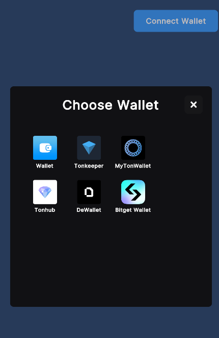
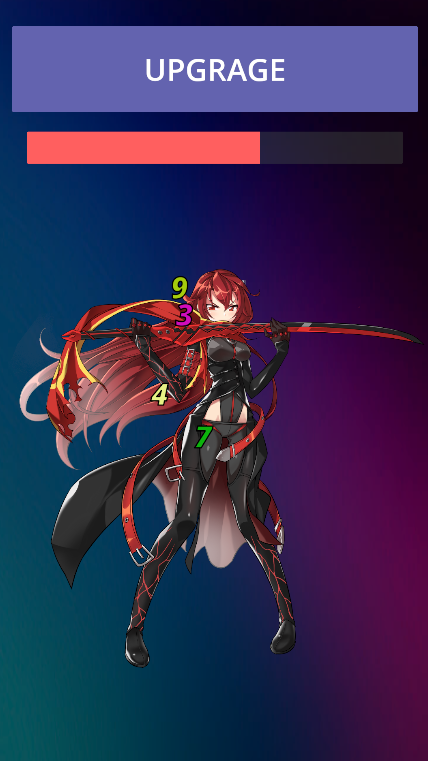
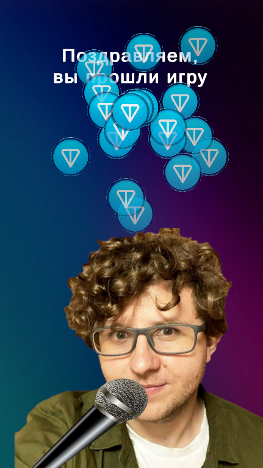

# Hackathon TON-Connected Unity Clicker Game

Welcome to the repository of our Unity project, which serves as the front-end application for our TON-connected clicker game. This project utilizes the Unity TonConnect 2.0 Asset and is built on Unity LTS version (2022.3 or newer).

## Getting Started

To get this project up and running, follow these steps:

1. **Build the Project**: Open the project in Unity and build it for your desired platform (WebGL is recommended for deployment).
2. **Create a Bot in Telegram**: Set up a new bot in Telegram and create a game for it. You can do this using the BotFather.
3. **Deploy an HTTPS Server**: For the Unity application to work, you need to deploy an HTTPS server. For the hackathon, you can use a Node.js server with ngrok to expose it to the internet.
4. **Host the Bot**: Host your Telegram bot and provide it with the link to your Unity WebGL application.

## Demonstration

Here are some screenshots demonstrating the functionality of our application:

## Dependencies

This project uses the [TonSDK](https://github.com/continuation-team/TonSdk.NET).

## Participants

- [Backend Developer (Python)](https://t.me/IPDan4ik)
- [Unity Developer](https://t.me/f4vir0)
- [Backend Developer and Designer](https://t.me/Akreeeal)

## License

This project is licensed under the MIT License - see the LICENSE.md file for details.

